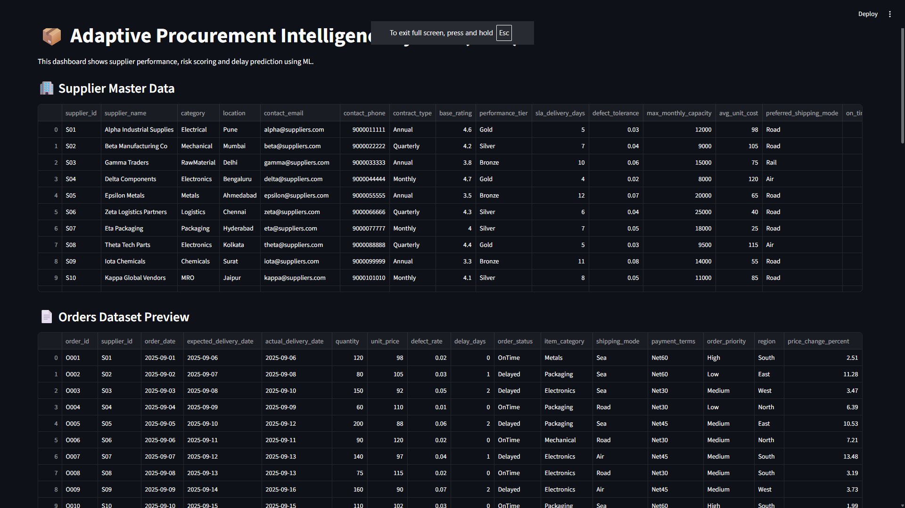

# Adaptive Procurement Intelligence System (APIS) 🚀

An **AI-powered procurement intelligence system** that helps organizations monitor supplier performance, calculate supplier risk scores, and predict delivery delays using **Machine Learning**.  
This project provides a complete working prototype with a **risk scoring module**, **ML-based prediction model**, and an **interactive Streamlit dashboard** for procurement analytics.

---

## 📌 Problem Statement

In real-world procurement, organizations face challenges like:

- Late deliveries from suppliers
- Rising defect rates in received goods
- Difficulty in identifying risky suppliers early
- Manual monitoring of procurement performance
- Lack of real-time supplier ranking and decision support

Traditional procurement systems are mostly reactive.  
**APIS solves this by using AI/ML to predict risks proactively** and support procurement teams with insights and recommendations.

---

## 🎯 Project Objectives

✔ Track supplier performance using procurement order data  
✔ Calculate supplier **risk score (0–100)** based on delivery and quality metrics  
✔ Predict whether a new order is likely to be **OnTime / Delayed**  
✔ Provide dashboards for procurement analytics and supplier ranking  
✔ Build a scalable foundation that can be upgraded to enterprise-level systems

---

## ✨ Key Features

### ✅ Supplier Risk Scoring

- Generates risk score using delay + defect patterns
- Higher score = higher procurement risk

### ✅ Supplier Risk Ranking Report

- Ranks suppliers based on average risk score
- Generates a report file: `supplier_risk_report.csv`

### ✅ Machine Learning Delay Prediction

- Trains an ML model to classify delivery outcome:
  - `OnTime`
  - `Delayed`

### ✅ Interactive Dashboard (Streamlit)

- Dataset preview
- Supplier risk ranking table
- Graphs (Order status distribution, avg delay per supplier)
- Prediction form for new orders

---

## 🏗️ System Workflow / Architecture

**1. Data Collection (CSV Dataset)**  
⬇  
**2. Data Preprocessing & Feature Selection**  
⬇  
**3. ML Model Training (RandomForestClassifier)**  
⬇  
**4. Risk Score Calculation + Supplier Ranking**  
⬇  
**5. Streamlit Dashboard for Visualization + Prediction**

---

## 🧰 Tech Stack

### 🖥️ Frontend / UI

- **Streamlit** (Dashboard UI)

### ⚙️ Backend / ML Engine

- **Python**
- **Pandas / NumPy**
- **Scikit-learn**
- **Joblib**

### 🗄️ Database / Storage

- CSV-based storage (`orders.csv`)
- (Upgradeable to SQLite / PostgreSQL)

---

## 📂 Project Structure

adaptive-procurement-intelligence-system/
│
├── app/
│ └── dashboard.py
│
├── dataset/
│ ├── orders.csv
│ └── supplier_risk_report.csv
│
├── models/
│ └── model.pkl
│
├── src/
│ ├── model_training.py
│ └── risk_score.py
│
├── requirements.txt
├── .gitignore
└── README.md

## 📊 Dataset Details

This project uses a **custom synthetic procurement dataset** (`orders.csv`) containing 200 order records.

### Dataset Columns:

- `order_id`
- `supplier_id`
- `order_date`
- `expected_delivery_date`
- `actual_delivery_date`
- `quantity`
- `unit_price`
- `defect_rate`
- `delay_days`
- `order_status`

---

## ⚙️ Installation & Setup

### ✅ 1) Clone the Repository

```bash
git clone https://github.com/RaKa8904/adaptive-procurement-intelligence-system.git
cd adaptive-procurement-intelligence-system
```

## 🚀 New Upgrades (Phase 2)

### ✅ Model Performance Comparison (Logistic Regression vs Random Forest)



### ✅ Delay Prediction Using Supplier History (Realistic Prediction)


